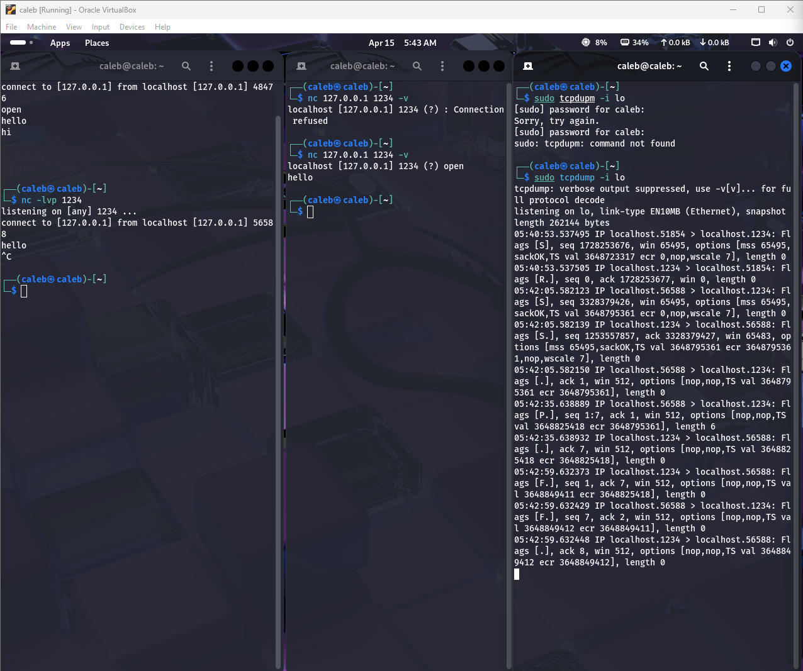
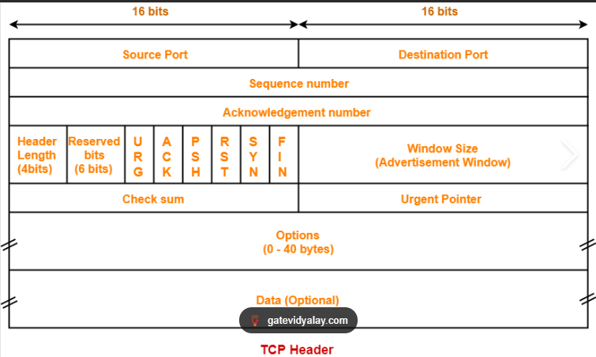
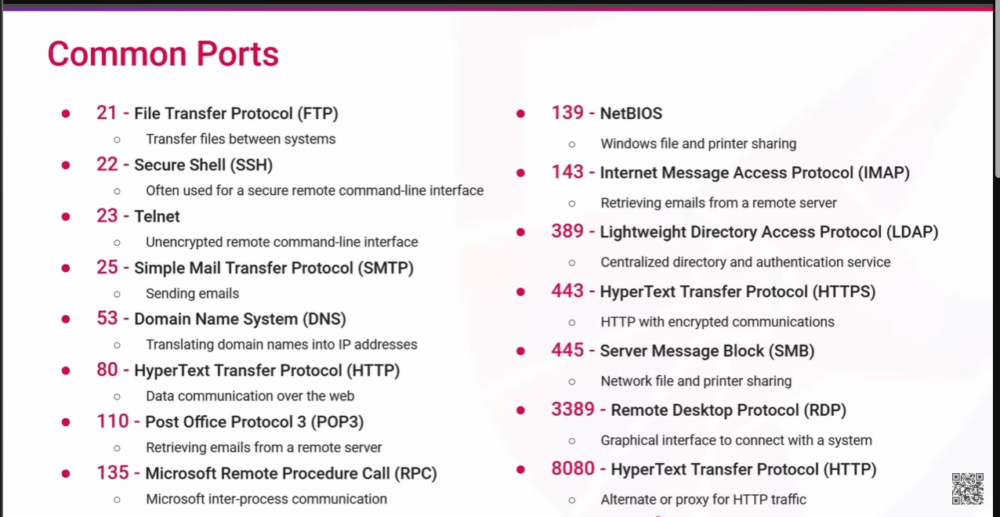

# Network Security Study Notes
> Course: Network Security (YouTube)
> Repo: [Network-Traffic-Analysis-Intrusion-Detection-Lab](https://github.com/tettetcaleb/Network-Traffic-Analysis-Intrusion-Detection-Lab)

---

## Table of Contents
1. [Network Security Theory](#1-network-security-theory)
2. [Network Layer Protocols](#2-network-layer-protocols)
3. [Packet Capture and Flow Analysis](#3-packet-capture-and-flow-analysis)
4. [tcpdump](#4-tcpdump)
5. [Wireshark](#5-wireshark)
6. [Intrusion Detection and Prevention Systems (IDS/IPS)](#6-intrusion-detection-and-prevention-systems-idsips)
7. [Snort](#7-snort)
8. [Network Traffic Analysis Practice](#8-network-traffic-analysis-practice)

---

## 1. Network Security Theory

### What is Network Security?
The practice of protecting a computer network from unauthorized access, misuse, malfunction, or attacks. It covers both hardware and software technologies.

### Key Goals (CIA Triad)
| Goal | Meaning |
|------|---------|
| **Confidentiality** | Only authorized users can access data |
| **Integrity** | Data is not tampered with in transit |
| **Availability** | Systems and data are accessible when needed |

### SOC Relevance
A SOC analyst's job is to monitor, detect, and respond to threats against all three of these goals. Everything in this course feeds into that workflow.


## 2. Network Layer Protocols

### Internet Protocol (IP)
The addressing system that identifies every device on a network.

| Version | Format | Example |
|---------|--------|---------|
| IPv4 | 32-bit, 4 octets | 192.168.1.1 |
| IPv6 | 128-bit, 8 groups | 2001:0db8::1 |

- **IP Routing** — the process of forwarding packets from source to destination across networks using routing tables.
- **SOC Relevance** — every alert has a source/destination IP. Knowing routing helps identify internal vs. external traffic and detect IP spoofing.

---

### TCP (Transmission Control Protocol)
Connection-oriented protocol — both sides must agree before data is sent.

**Three-Way Handshake:**
```
Client  →  SYN        →  Server
Client  ←  SYN-ACK    ←  Server
Client  →  ACK        →  Server
(Connection established)
```
This is a picture of the 3 way handshake being shown in real time: 

- **Reliable** — guarantees delivery, retransmits lost packets
- **Flow control** — prevents sender from overwhelming receiver
- **SOC Relevance** — SYN flood attacks abuse the handshake by sending thousands of SYNs without completing the connection, exhausting server resources. Incomplete handshakes in packet captures = red flag.

  

Source & Destination Port — identify which application is sending and receiving (e.g. port 443 = HTTPS, port 22 = SSH). SOC use: spotting unusual ports used for data exfiltration or C2 traffic.

Sequence Number — a number assigned to each byte of data so the receiver can reassemble packets in the correct order. Also used to detect missing or duplicate packets.

Acknowledgment Number — tells the sender which byte the receiver expects next, confirming what was successfully received. This is how TCP guarantees delivery.

Data Offset — tells the receiver where the actual data starts, since the header can vary in size due to options.

Reserved — unused bits, set to zero. Reserved for future use by the protocol.

Flags — 9 control bits that manage the state of the connection. The key ones are SYN (start connection), ACK (acknowledge), FIN (close connection), RST (reset/abort), and PSH (send data immediately). SOC use: a flood of SYN packets with no ACK = SYN flood attack. Unexpected RST packets can indicate a port scan.

Window Size — how many bytes the receiver can accept before needing an acknowledgment. Controls the flow so neither side gets overwhelmed.

Checksum — verifies the header and data haven't been corrupted in transit. If it doesn't match, the packet is dropped.

Urgent Pointer — only active when the URG flag is set, points to urgent data that should be processed immediately. Rarely used in normal traffic.

Options — optional extra settings like maximum segment size or timestamps. Padded to keep the header aligned to 32-bit boundaries.

Common ports: 

---

---

### UDP (User Datagram Protocol)
Connectionless protocol — fires packets without confirming receipt.

- **Faster** than TCP, no handshake overhead
- **No guarantee** of delivery or order
- **Used for**: VoIP, video streaming, DNS, online gaming

- **SOC Relevance** — DNS tunneling (data exfiltration technique) runs over UDP port 53. Unusual spikes in outbound UDP traffic to external IPs can indicate C2 (command and control) communication.

---

## 3. Packet Capture and Flow Analysis

Packet: A packet is a small, structured unit of data transmitted over a network, carrying both the actual information and control details to ensure it reaches its destination correctly.

Parts of a packer :
  
  -Header: is the control section at the start of a network packet that contains essential information for delivering and processing the data payload

  -Payload:  refers to the actual data being transmitted from the sender to the receiver.

  -Trailer: A packet trailer is supplemental data added to the end of a network packet, primarily used for error checking and ensuring data integrity.

Packert Capture(PCAP):

  -Intercepting Packets: involves capturing and analyzing data packets traveling across a network, which can be done using various tools and techniques for legitimate purposes like network monitoring and security analysis

  Methods of intercepting packets include:
    
    -Port mirroting (SPAN Ports): a technique used in networking to copy packets from a specified source port to a destination port without affecting the original packet processing on the network device, such as a switch or router.

   - Inline network Devices: These devices are integral to the functioning and security of a network, as they monitor, regulate, and control the flow of data packets within the network.

   - Network taps: A network tap is a hardware or software device that provides complete, real-time access to network traffic for monitoring, security, and performance analysis without impacting network performance.
  
Packet captures are stored through:

  PCAP Files:data file created by network packet capture tools like Wireshark.
  
  Advantages  of PCAP File:
    - most detailed record
    - includes packet [ayload

   Disavantages
  - resource intensive
  - requires significant storage space
  -Hard to scale

Flow Records: Flow records in networking are essential for monitoring and analyzing network traffic

  - Aggregated metadata
  - 5-tuple
      - source IP
      - source Port
      - Destination IP
      - Destination Port
      - Transport Protocol

    Advantages
      - Efficient bandwidth and storage requiremts
      - high level pattern and anamoly detection
      - easier to scale
   
    Disadvantages
      - lacks payload deteal
      - doesnt give you the whole picture


---

## 4. tcpdump

tcpdump — What It Is & How It Works
tcpdump is a command-line packet analyzer that runs on Linux/Unix systems. It intercepts and displays network packets passing through a network interface in real time, or saves them to a file for later analysis.


How It Works

tcpdump uses the libpcap library to capture raw packets directly from a network interface at the OS level, before the firewall or application layer processes them. You need root/sudo to run it because it operates in promiscuous mode — meaning it captures all traffic on the interface, not just traffic addressed to your machine.

Core Uses

1. Real-Time Traffic Monitoring

Watch live traffic on an interface to see what's happening on your network right now.
bashsudo tcpdump -i eth0
2. Capturing to a File

Save packets to a .pcap file to analyze later in Wireshark or other tools.
bashsudo tcpdump -i eth0 -w capture.pcap
3. Reading a Capture File

bashsudo tcpdump -r capture.pcap
4. Filtering Traffic

This is where tcpdump becomes powerful. You can isolate exactly what you care about using Berkeley Packet Filter (BPF) syntax.

Filter     Command

By hosttcpdump host 192.168.1.10

By source IPtcpdump src 10.0.0.5

By destination IPtcpdump dst 10.0.0.5

By porttcpdump port 443

By protocoltcpdump icmp or tcp or udp

Combine filterstcpdump src 10.0.0.5 and port 80

Exclude traffictcpdump not port 22

5. Verbose Output
See more packet detail — TTL, checksum, flags, etc.
bash
sudo tcpdump -v    # verbose
sudo tcpdump -vv   # more verbose
sudo tcpdump -vvv  # maximum detail

7. Show Packet Contents

Display the actual payload data in hex and ASCII — useful for spotting cleartext credentials or malicious strings.

bash
sudo tcpdump -X -i eth0 port 80

9. Limit Capture Count
Stop after capturing N packets.

bash
sudo tcpdump -c 100 -i eth0

Security & Forensics Uses

Incident response — capture traffic during an active breach to see what data is leaving

Detecting port scans — a flood of SYN packets to many ports is a clear nmap signature

Finding cleartext credentials — HTTP, FTP, Telnet traffic can expose passwords

C2 beaconing detection — regular outbound connections to unknown IPs at set intervals

DNS analysis — spot unusual domain lookups or DNS tunneling

Validating firewall rules — confirm traffic is actually being blocked


Key Flags Cheat Sheet
bash-i eth0       # specify interface
-w file.pcap  # write to file
-r file.pcap  # read from file
-n            # don't resolve hostnames (faster)
-nn           # don't resolve hostnames OR port names
-v / -vv      # verbosity
-X            # show hex + ASCII payload
-c 50         # capture only 50 packets
-A            # show payload in ASCII only

tcpdump vs Wireshark
|Feature       |tcpdump                           |Wireshark                                              |
|--------------|----------------------------------|-------------------------------------------------------|
|Interface     |Command line                      |GUI                                                    |
|Best for      |Remote servers, scripting,        |Deep analysis, visualization                           |
|resource use  |Very lightweight                  |Heavier                                                |
|Output        |Terminal / .pcap file             |.pcap file with visual decode                          |
|Typical use   |Capture on server → transfer →    |analyzeAnalyze locally                                 |

---

## 5. Wireshark

> *Notes coming — section in progress*

---

## 6. Intrusion Detection and Prevention Systems (IDS/IPS)

> *Notes coming — section in progress*

---

## 7. Snort

> *Notes coming — section in progress*

---

## 8. Network Traffic Analysis Practice

> *Notes coming — section in progress*

---

## Key Terms Glossary

| Term | Definition |
|------|------------|
| **Packet** | A unit of data transmitted over a network |
| **Protocol** | A set of rules governing how data is transmitted |
| **Port** | A logical endpoint for communication (e.g., port 80 = HTTP) |
| **IP Spoofing** | Faking a source IP address to disguise the origin of an attack |
| **SYN Flood** | A DoS attack that abuses the TCP handshake |
| **DNS Tunneling** | Encoding data in DNS queries to exfiltrate information |
| **C2 (Command & Control)** | A server used by attackers to communicate with compromised systems |
| **pcap** | Packet capture file format used by Wireshark and tcpdump |
| **IDS** | Intrusion Detection System — monitors and alerts on suspicious activity |
| **IPS** | Intrusion Prevention System — monitors and actively blocks threats |

---

*Last updated: April 2026*
