# Network-Traffic-Analysis-Intrusion-Detection-Lab

tcpdump

Section 1: tcpdump Basics

1.1 Listing Available Network Interfaces
The first thing I did was list all the available network interfaces on my machine so I could figure out which one to monitor.
 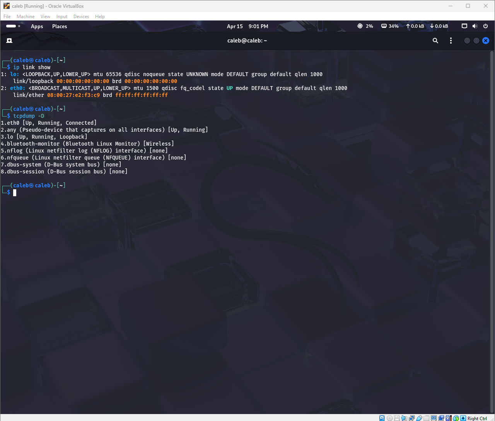

1.2 Monitoring a Network Interface
I decided to monitor the loopback interface (lo) to watch traffic being sent between processes on my local machine.
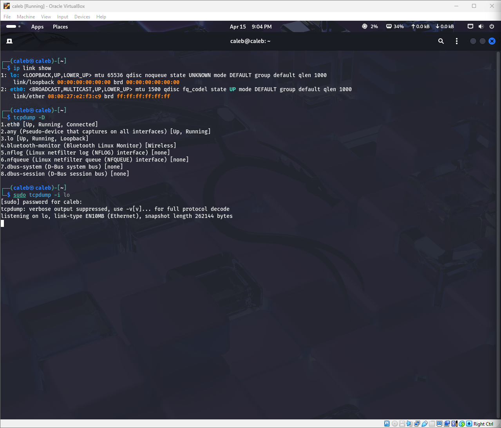

1.3 Simulating Traffic and Watching the Three-Way Handshake
I then simulated real traffic to watch the TCP three-way handshake happen in real time — the SYN, SYN-ACK, and ACK packets all showed up exactly as expected.
 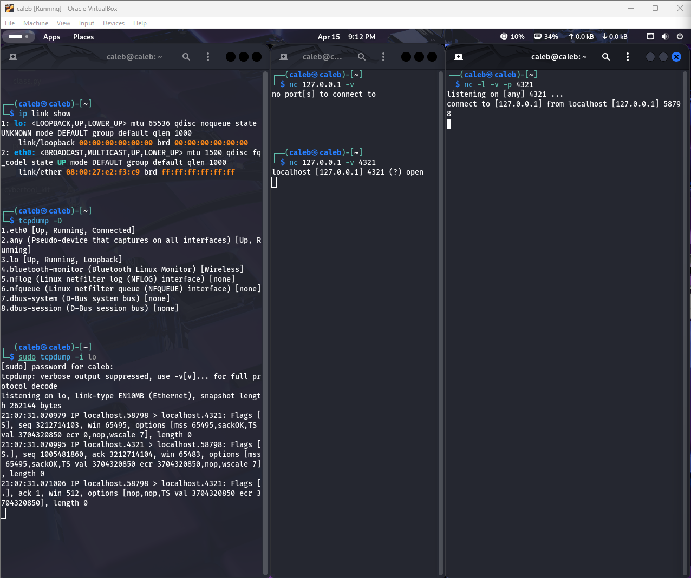

Section 2: Capturing Network Traffic

2.1 Capturing Traffic on a Selected Interface
I selected an interface and used tcpdump to display its live traffic, giving me a real-time view of what was moving across the network.
 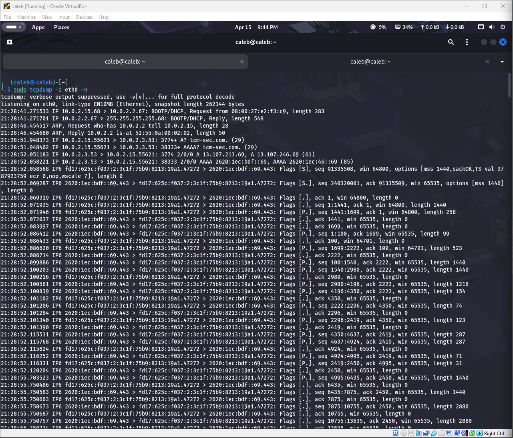

 2.2 Filtering Traffic by IP Address Range
I then applied a filter to only show packets coming from or going to a specific range of IP addresses. This is useful when you want to zero in on traffic from particular hosts instead of seeing everything at once.
 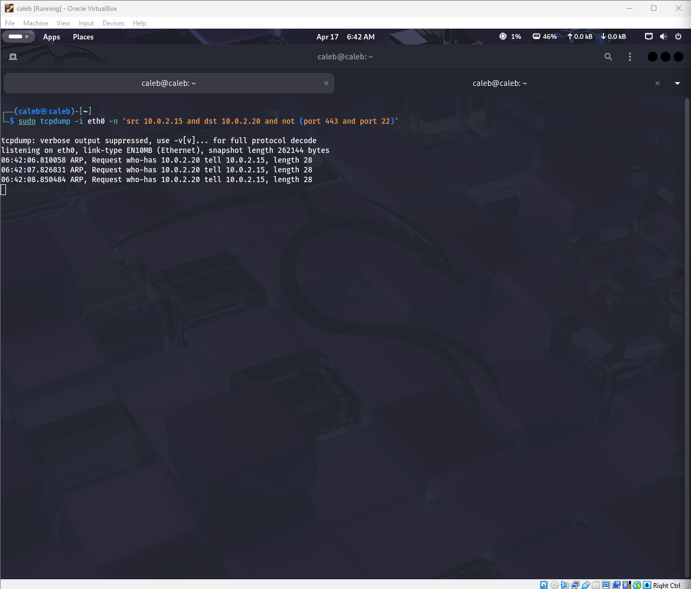

 Section 3: Analyzing a LockBit Ransomware PCAP
 This was the main part of this section ofthe lab. I got my hands on a PCAP file that was captured during a LockBit ransomware infection and started digging through it to trace what happened.

 
 3.1 Opening the PCAP File
I loaded the PCAP file into tcpdump and immediately noticed a huge amount of traffic between IP addresses on port 80.
 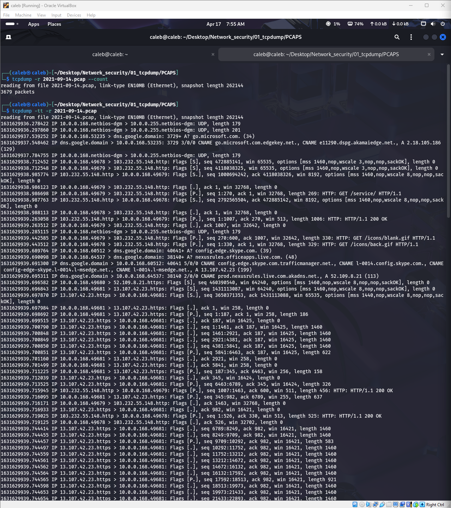

   
 3.2 Filtering for Port 80 Traffic
Since most of the traffic was on port 80 (HTTP), I filtered the capture to only show that. HTTP traffic is unencrypted so it's a good place to look for malware activity since you can actually read what's being sent.
 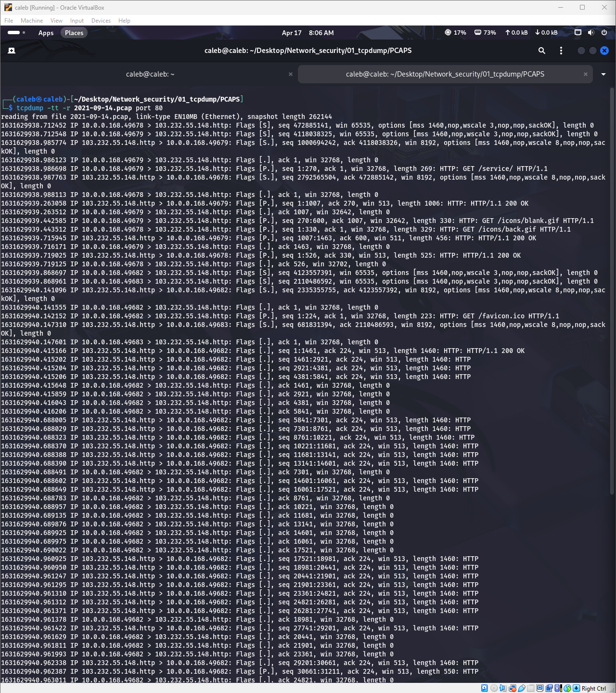

3.3 Grepping for HTTP GET and POST Requests
I used grep to filter the output further and only show HTTP GET and POST requests. This is where things got interesting — I could see exactly what the infected machine was requesting from the network.
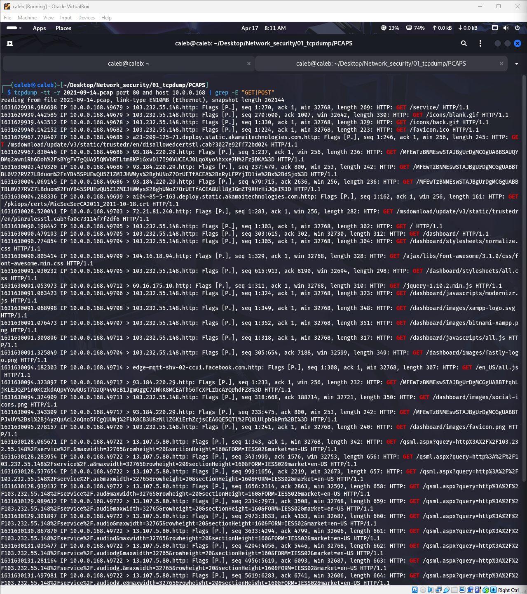

3.4 Investigating the Source IP
At first glance, audiologg.exe looked like it might be associated with Microsoft. But I had to confirm it. I looked up the IP address it was being served from and found it was geolocated in Vietnam with zero connection to Microsoft. Legitimate Microsoft files don't get served from random servers in Vietnam, so this was a clear red flag.
 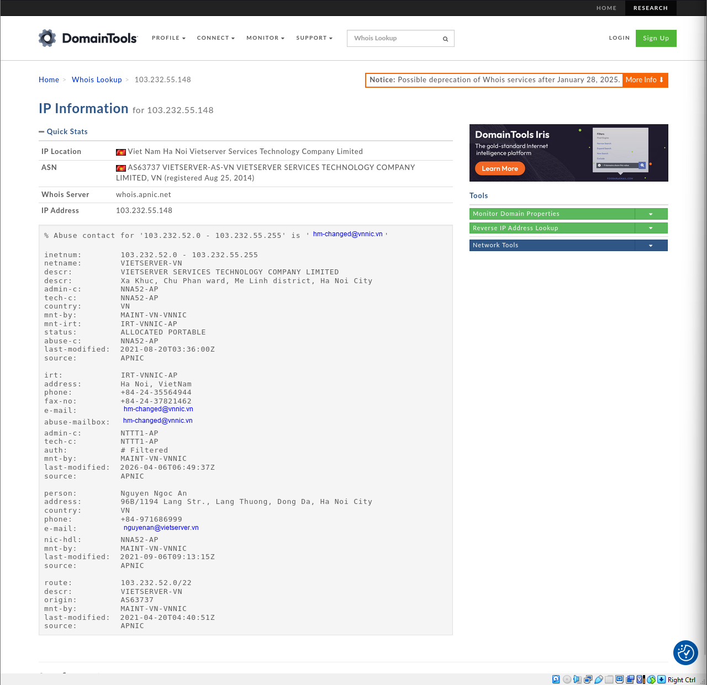

3.5 Extracting and Decoding the Malicious URL
I ran another grep to isolate all packets that contained the audiologg.exe filename, then opened them up to inspect the raw data. I copied out the encoded URL I found inside the packet and threw it into CyberChef to decode it, which gave me the full download URL the malware was using.
 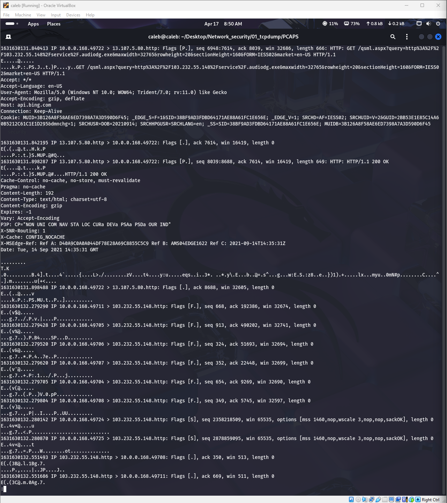
 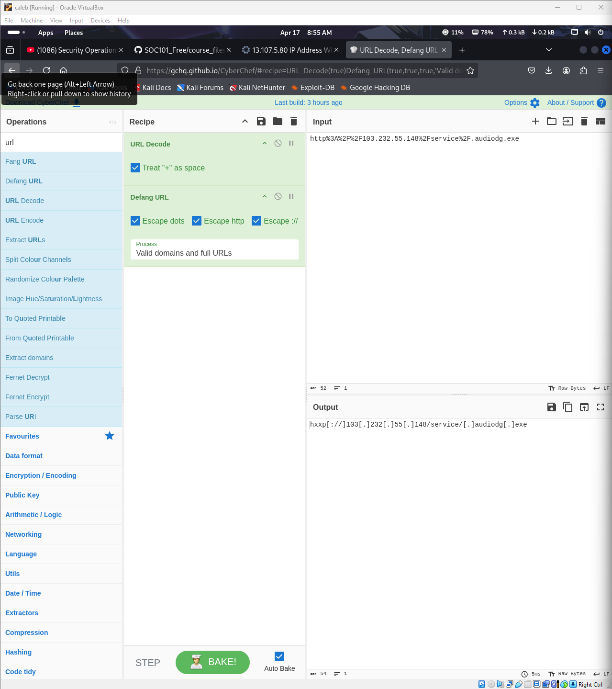

 3.6 Confirming on VirusTotal
Finally, I took the decoded URL and looked it up on VirusTotal. It came back flagged as malicious by multiple vendors that confirmed it. The URL is a known threat indicator tied to the LockBit ransomware campaign.
 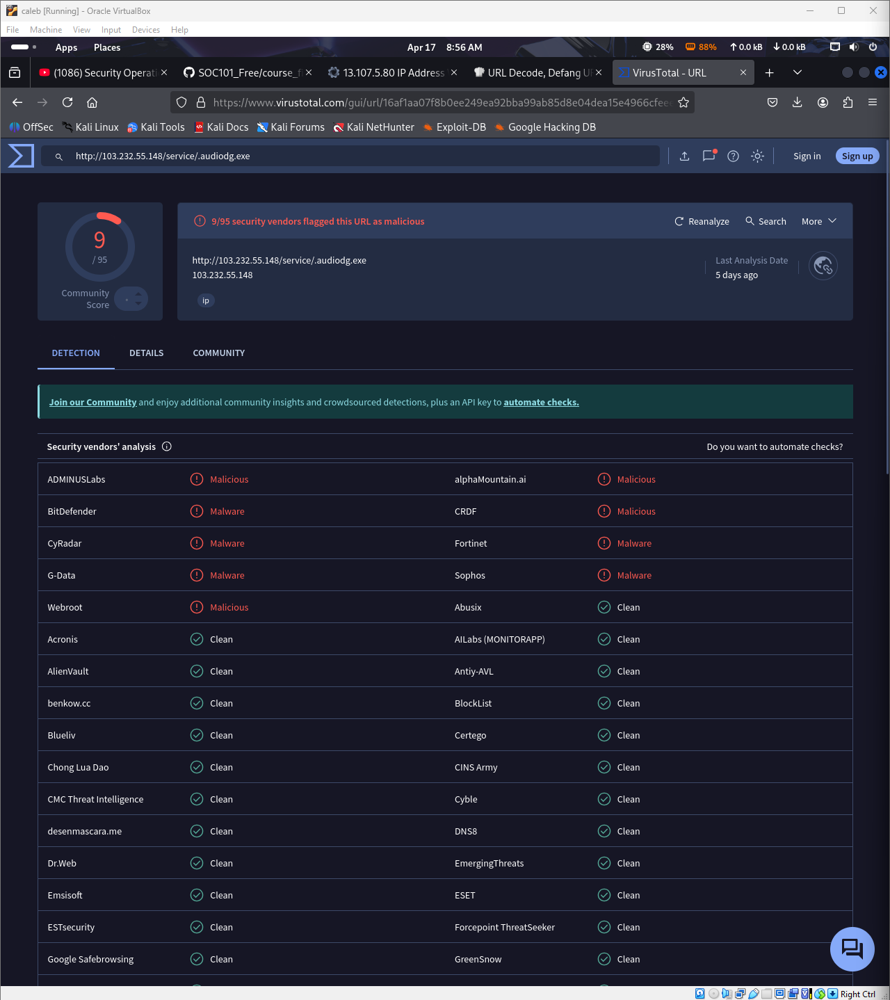

 Wireshark

 Capture and display filters
 - This is an example of me using wireshark to capture traffice from www.example.com woles excluding ports such as 80 and 25

 - here is me using display filters to display only http traffic

Statistics
- Capture file properties: This allows me to view metadata and useful data about the packet file
  
- Reserved Address : This allows me to see where a DNS lookup was peformed and an IP address was maaped to a domain

- Protocol Heirachy : This provides percentages for every protocol in a packet capture, organized by protocol layers.

- Conversations : This shows me all two-way communication pairs.

- Endpoints : This feature similar is to Conversations but is focused on individual hosts rather than pairs

wireshark also allows me to follow a specific stream of traffic which is way more oonvinient than tcpdump
   
